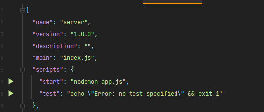
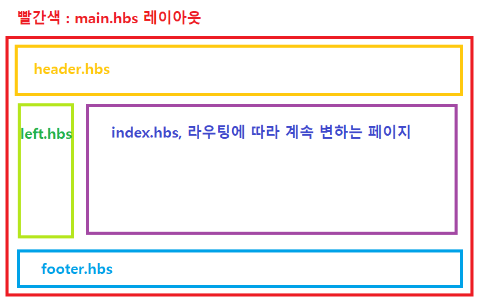

package.json 파일 들어가서 모듈 확인해보고 server 경로의 터미널 열고나서 
   
  start에 보면 app.js를 실행시키는 문장이 있음, 터미널에 yarn start나 npm start를 하면 이걸 실행시키는 거임
  localhost:5000으로 홈페이지 들어가면 서버랑 같이 돌아가고 있음을 알 수 있음
  <h3>핸들러</h3>
server js에서 views 폴더에 layouts하고 partials로 구분지어 놓음 
  layouts에서는 모든페이지에 항상 있는 부분을 지정
  partials 폴더에는 자주쓰는 html 문구를 모아둬야함

